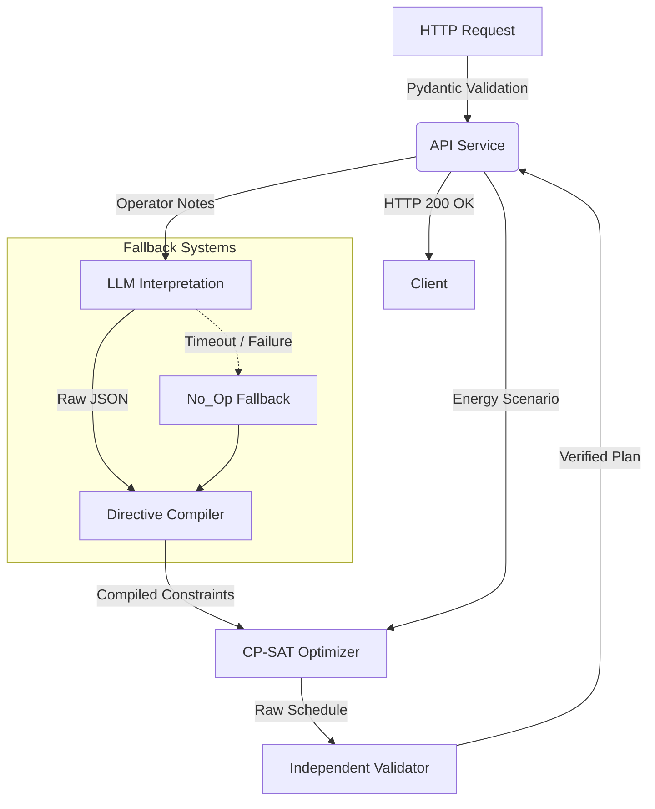

# GridWise LLM Optimization Engine ⚡

GridWise is an advanced AI-powered energy scheduling engine built for the BUP CSE Fest 2026 Hackathon. It bridges natural language operator directives with mathematically proven integer linear programming (CP-SAT) to optimize 24-hour battery and grid operations.

---

## 🏗️ 1. Project Overview

GridWise ensures grid resilience by minimizing electricity costs using battery arbitrage (charging during cheap off-peak hours and discharging during expensive peak hours) while respecting physical solar limits, battery degradation invariants, and dynamic human instructions.

The system is deployed as a strict `FastAPI` REST backend. All operator notes are deterministically parsed by `Google Gemini 3 Flash` into constrained JSON structures before entering the compiler.

## 🌐 Live Endpoint
The API is live and accessible at: **[https://bup-cse-fest-hackathon-2026.onrender.com](https://bup-cse-fest-hackathon-2026.onrender.com)**

## 🗺️ 2. Architecture Diagram



## ⚙️ 3. Installation Steps

### Prerequisites
- Python 3.12+
- Valid Google Gemini API Key

### Setup
1. Clone the repository:
   ```bash
   git clone https://github.com/NaimurRahmannn/BUP_CSE_FEST_HACKATHON_2026.git
   cd BUP_CSE_FEST_HACKATHON_2026
   ```
2. Create and activate a virtual environment:
   ```bash
   python -m venv .venv
   # Windows
   .venv\Scripts\activate
   # Linux/Mac
   source .venv/bin/activate
   ```
3. Install dependencies:
   ```bash
   pip install -r requirements.txt
   ```

## 🔐 4. Environment Setup

Create a `.env` file in the root directory based on the `.env.example`:

```env
GOOGLE_GEMINI_API_KEY=your_actual_key_here
GOOGLE_GEMINI_MODEL=gemini-3-flash
LLM_TIMEOUT_SECONDS=10
SOLVER_TIMEOUT_SECONDS=20
PIPELINE_VERSION=1.0
```

## 🚀 5. Running Locally

Start the FastAPI application via Uvicorn:

```bash
uvicorn api.main:app --host 0.0.0.0 --port 8000 --reload
```

The server will be available at `http://localhost:8000`.
You can view the interactive Swagger documentation at `http://localhost:8000/docs`.

## 🧪 6. Running Tests

The system features a comprehensive 76-test suite covering the optimizer mathematically, the directive compiler, the LLM parser fallbacks, and the E2E API scenarios.

To run the regression suite:
```bash
pytest -v
```

## 🔌 7. API Usage

The core endpoint is `POST /optimize-energy`. It accepts a 24-hour scenario, battery specifications, and natural language operator notes, returning an optimized hourly schedule.

For detailed request/response JSON schemas, see [API_USAGE.md](docs/API_USAGE.md).

### Request Example
```json
{
  "scenario_id": "EXAMPLE-01",
  "hours": [
    {"hour": 0, "demand_kwh": 30, "solar_kwh": 0, "tariff_bdt_per_kwh": 5}
  ],
  "battery": {
    "capacity_kwh": 200,
    "initial_energy_kwh": 50,
    "minimum_energy_kwh": 10,
    "max_charge_kwh_per_hour": 50,
    "max_discharge_kwh_per_hour": 50
  },
  "operator_notes": [
    "Solar output reduced to 0% from 1 PM to 3 PM",
    "Do not charge battery during peak hours"
  ]
}
```

### Response Example
```json
{
  "scenario_id": "EXAMPLE-01",
  "directive_interpretation": [
    {
      "note_index": 0,
      "applies": true,
      "directive_type": "solar_reduction",
      "structured_adjustment": {
        "hours": [13, 14],
        "factor": 0.0
      },
      "explanation": "Processed note 'Solar output reduced...' as solar_reduction"
    }
  ],
  "hourly_plan": [
    {
      "hour": 0,
      "grid_kwh": 10.5,
      "battery_energy_after_kwh": 60.5,
      "battery_kwh": 10.5
    }
  ],
  "summary": {
    "total_grid_kwh": 120.0,
    "total_cost_bdt": 650.0,
    "peak_grid_kwh": 50.0,
    "plan_summary": "Optimized schedule. Cost: 650.0 BDT."
  },
  "validation": {
    "success": true,
    "errors": []
  }
}
```

## 🐳 8. Deployment Instructions

The application is containerized and available on the GitHub Container Registry (GHCR).

1. **Pull the Docker Image:**
   ```bash
   docker pull ghcr.io/naimur-rahmannn/gridwise-llm:latest
   ```

2. **Run the Container:**
   ```bash
   docker run -p 8000:8000 --env-file .env ghcr.io/naimur-rahmannn/gridwise-llm:latest
   ```

3. **Health Check:**
   Verify deployment is live:
   ```bash
   curl http://localhost:8000/health
   ```

## ⚠️ 9. Known Limitations
- **LLM Latency / Sequential Execution:** Operator notes are currently processed sequentially by Gemini 3 Flash. While this guarantees deterministic outputs and limits batch hallucination risk, processing 3 heavily complex notes on a slow network may approach the 10-second LLM processing limit. The system gracefully degrades to a `no_op` if it is about to violate the 30-second maximum timeout ceiling.
- **Factor Boundaries:** Non-operational notes or directives that are completely ambiguous (e.g., "The weather is bad") will be explicitly dropped and interpreted as `no_op` to protect mathematical optimality.
